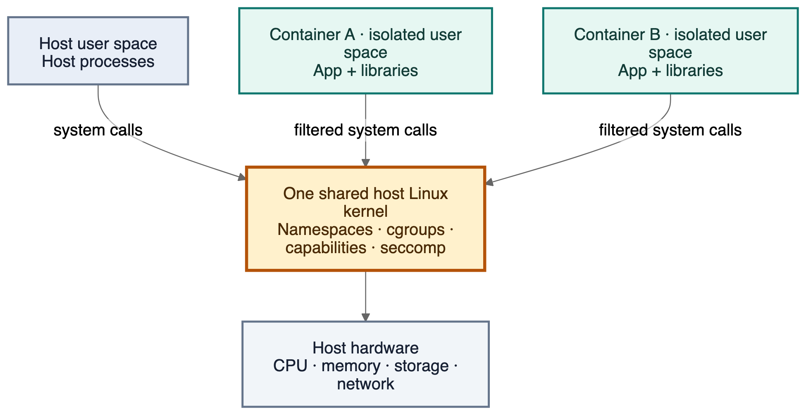

A coding agent does not just run your code.

It installs packages. It clones repositories. It executes build scripts. It parses files from strangers. It reads webpages. It may follow instructions embedded inside those files or webpages.

At some point, the command your agent executes becomes untrusted input.

That changes what we need from a sandbox.

Docker provides useful process isolation for applications. But an AI-agent sandbox has a different requirement: it should assume that code inside the environment may actively try to attack the isolation boundary.

This does **not** mean that a Docker container can execute commands on its host simply because the container shares the host kernel.

A normally configured container cannot do that.

To reach the host, an attacker usually needs one of three paths:

1. **Host access that the operator explicitly granted**, such as the Docker socket, writable host mounts, host namespaces, excessive capabilities, or `--privileged`.
2. **A vulnerability** in the Linux kernel, `runc`, `containerd`, Docker, or another runtime component.
3. **Control-plane access** that lets an attacker create containers with dangerous configuration.

That distinction matters.

The problem with Docker for hostile agent workloads is not that containers have no security boundary. They do.

The problem is that the container and host still depend on the same kernel, while agent workloads have a much stronger incentive to probe every mistake and every vulnerability in that boundary.

A microVM changes that architecture. It gives the workload its own guest kernel and places a hardware virtualization boundary between that guest and the host.

That does not make the workload magically secure.

It does give an attacker another boundary to cross.

## The command your agent runs is untrusted input

Consider a coding agent that receives a GitHub repository and this task:

> Fix the failing tests and open a pull request.

The agent may run:

```bash
npm install
npm test
pip install -r requirements.txt
make
cargo build
```

Those commands look routine.

But each one can execute code that the person who operates the agent did not author.

An `npm` package can contain install scripts. A `Makefile` can execute arbitrary shell commands. A repository can contain instructions for an agent. A webpage can contain a prompt injection. A dependency can be compromised upstream.

The agent does not need to become malicious.

It only needs to act on malicious input.

This creates a different security model from a typical web service.

A normal application container often runs code that its operator chose, built, reviewed, and deployed.

An agent sandbox may run code from an unknown repository five seconds after it first sees that repository.

The sandbox therefore has to treat the workload itself as potentially hostile.

## What a Docker container actually is

A Docker container is not a small virtual machine.

At the Linux level, it is a set of processes that run on the host kernel with several isolation mechanisms around them.


_Each container has an isolated user space, but its system calls still reach the host's shared Linux kernel._

The important ones are:

* **Namespaces** isolate resources such as processes, mounts, networking, IPC, and hostnames.
* **cgroups** account for and restrict CPU, memory, and other resources.
* **Linux capabilities** split root privileges into smaller permissions.
* **seccomp** restricts which system calls a process can make.
* **AppArmor or SELinux** can place additional policy around what container processes may access.
* **Filesystem isolation** gives the container its own root filesystem unless the operator explicitly shares host paths.

The kernel remains shared.

If a container calls `open()`, `mount()`, `clone()`, `ioctl()`, or another system call, that request eventually reaches the same Linux kernel that serves the host.

The namespaces and other controls decide what the process can see and what the kernel will permit.

Docker itself describes namespaces as a major isolation mechanism and treats the Docker daemon, kernel, container configuration, and kernel hardening features as separate parts of the security model. Docker also starts containers with a restricted capability set.

This is an important distinction:

> **A shared kernel increases the value of a kernel exploit. It does not automatically give a container access to the host.**

## What Docker prevents by default

Docker deserves credit here.

Start a normal container:

```bash
docker run --rm -it ubuntu:24.04 bash
```

The process inside it does not normally have access to the host root filesystem.

It does not normally see every host process.

It does not receive every Linux capability.

It cannot simply mount arbitrary filesystems.

Docker also applies its default seccomp profile, which currently blocks roughly 44 system calls out of more than 300. The blocked set includes operations with high security value such as kernel module manipulation, several namespace operations, `mount`, `reboot`, `setns`, and other sensitive calls.

For example, this fails in a normal container:

```bash
mount -t tmpfs none /mnt
```

Docker drops `CAP_SYS_ADMIN` by default, so the kernel rejects the operation. Docker’s documentation uses this exact class of example to show the difference between a normal and privileged container.

This is real isolation.

The interesting security question is what happens when we start removing those layers.

# How the Docker boundary gets weaker

Most container escape discussions become misleading because they mix two very different cases:

* an actual vulnerability in a container boundary
* an operator who explicitly connected the container to sensitive host resources

The second category is much more common and much easier to demonstrate.

## 1. The Docker socket

Consider this mount:

```bash
-v /var/run/docker.sock:/var/run/docker.sock
```

The file looks harmless. It is just a Unix socket.

Architecturally, however, it connects the container to the Docker control plane.

Docker explicitly documents that a container with access to this socket can create and manipulate resources through the host daemon.

A process that controls a rootful Docker daemon can ask that daemon to create containers with host mounts, elevated privileges, devices, and other powerful configuration.

That makes access to the Docker daemon close to host-level authority.

The important point is not:

> Docker socket = container escape.

The more precise statement is:

> Docker socket = access to a control plane that is allowed to create configurations with host-level access.

For an agent sandbox, the daemon socket should not exist inside the workload.

## 2. Writable host bind mounts

Suppose you run:

```bash
docker run \
  --mount type=bind,src=/srv/project,dst=/workspace \
  agent
```

The container now has a direct path to `/srv/project` on the host.

By default, Docker bind mounts are writable. A process inside the container can create, alter, or delete files in the mounted host directory. Docker calls out that security implication directly in its documentation.

This is not an escape.

The host explicitly shared that directory.

That distinction matters because the correct defense is different: restrict what you mount, prefer read-only mounts where possible, and never share broad host paths with untrusted workloads.

## 3. `--privileged`

`--privileged` changes the threat model far more dramatically.

Docker documents that it:

* enables all Linux capabilities
* disables the default seccomp profile
* disables the default AppArmor profile
* disables the SELinux process label
* grants access to host devices
* makes `/sys` writable
* makes cgroup mounts writable

Docker explicitly warns that a privileged container is not a securely sandboxed process and may gain control over the host.

If the workload is untrusted, `--privileged` should usually end the security discussion.

You no longer have the boundary that people generally mean when they say "Docker sandbox."

## 4. Host namespaces

Docker can also let a container join host namespaces:

```bash
--pid=host
--network=host
--userns=host
```

These flags do not all have the same security impact.

`--pid=host` removes PID namespace isolation, so the container can see host process identifiers.

`--network=host` removes the normal network namespace boundary.

`--userns=host` disables user-namespace remap for that container if the daemon uses user remapping. Docker documents this behavior directly.

None of these flags should be translated to "instant host root."

They remove boundaries.

What the workload can do after that still depends on capabilities, filesystem access, LSM policy, runtime configuration, and vulnerabilities.

For hostile code, however, each removed boundary gives the attacker more information or more host surface to probe.

## 5. Extra capabilities

Linux capabilities break root powers into smaller units.

Docker removes many dangerous capabilities by default.

You can add them back:

```bash
docker run --cap-add=SYS_ADMIN ...
```

`CAP_SYS_ADMIN` is especially broad and gates a large set of kernel operations.

It does not automatically give a normal container unrestricted host access, because namespaces and other controls still apply.

But it expands the set of kernel interfaces available to the workload.

For code that you already trust, that may be an acceptable requirement.

For code that may actively search for a breakout, every extra capability enlarges the attack surface.

## 6. Disabled seccomp or LSM policy

You can disable seccomp:

```bash
--security-opt seccomp=unconfined
```

You can also weaken or disable AppArmor or SELinux policy.

Again, neither action equals an automatic escape.

They remove defense-in-depth.

That matters because a vulnerability often requires access to a particular syscall, path, device, or kernel API. A seccomp or LSM policy can prevent the attacker from reaching that primitive even if vulnerable kernel code exists.

Docker recommends that users keep the default seccomp profile rather than disable it.

## 7. Rootful Docker daemon access

Docker normally runs its daemon as root unless you opt into rootless mode.

Docker therefore recommends that only trusted users control the daemon. Its security documentation gives a concrete reason: the daemon can create a container with the host root filesystem shared inside it.

This becomes important for agent platforms.

Suppose an API accepts something like:

```json
{
  "mounts": [...],
  "capabilities": [...],
  "network": "..."
}
```

If an attacker can influence those values, the application may effectively expose part of the Docker control plane even if the Docker socket itself never enters the sandbox.

A sandbox service must secure both the workload boundary and the control plane that creates that workload.

# A safe lab: inspect the Docker boundary

We can demonstrate these architectural properties without publish a container escape.

The lab has three steps:

```text
docker-boundary-demo/
├── Dockerfile
├── package.json
├── tsconfig.json
└── src/
    ├── inspect-isolation.ts
    ├── probe-docker-socket.ts
    └── write-canary.ts
```

The goal is not to exploit Docker.

The goal is to see which host communication paths exist.

## Step 1: inspect a normal container

Create `src/inspect-isolation.ts`:

```ts
import {
  existsSync,
  readFileSync,
  readlinkSync,
  readdirSync,
} from "node:fs";

const namespaces = Object.fromEntries(
  readdirSync("/proc/self/ns").map((name) => [
    name,
    readlinkSync(`/proc/self/ns/${name}`),
  ]),
);

const status = readFileSync("/proc/self/status", "utf8");

const securityFields = Object.fromEntries(
  status
    .split("\n")
    .filter((line) =>
      ["CapEff:", "CapBnd:", "NoNewPrivs:", "Seccomp:"].some((key) =>
        line.startsWith(key),
      ),
    )
    .map((line) => {
      const [key, ...value] = line.split(/\s+/);
      return [key.replace(":", ""), value.join(" ")];
    }),
);

console.log({
  kernel: readFileSync("/proc/sys/kernel/osrelease", "utf8").trim(),
  namespaces,
  security: securityFields,
  dockerSocketPresent: existsSync("/var/run/docker.sock"),
});
```

Run it in a normal container:

```bash
docker build -t docker-boundary-demo .

docker run --rm docker-boundary-demo \
  node dist/inspect-isolation.js
```

Several things should stand out.

The process has namespace identifiers of its own.

The Docker socket should not exist.

The capability mask is restricted.

Seccomp should be active under a standard Docker setup.

But the kernel version comes from the host kernel.

That last fact demonstrates the shared-kernel architecture without implying that the container owns the host.

## Step 2: share one harmless host directory

Now create a temporary host directory:

```bash
mkdir -p /tmp/docker-boundary-demo
echo "host-original" > /tmp/docker-boundary-demo/canary.txt
```

Our demo script only changes that file:

```ts
import { appendFileSync, readFileSync } from "node:fs";

const path = "/demo/canary.txt";

console.log("before:");
console.log(readFileSync(path, "utf8"));

appendFileSync(path, "container-was-here\n");

console.log("after:");
console.log(readFileSync(path, "utf8"));
```

Run the container with only that directory attached:

```bash
docker run --rm \
  --mount type=bind,src=/tmp/docker-boundary-demo,dst=/demo \
  docker-boundary-demo \
  node dist/write-canary.js
```

Then inspect the host:

```bash
cat /tmp/docker-boundary-demo/canary.txt
```

You should see:

```text
host-original
container-was-here
```

No escape occurred.

Docker did exactly what we asked it to do.

We granted the container write access to host state, so the container changed that host state.

That is why agent sandboxes need strict mount policy.

## Step 3: prove that the Docker socket is a control-plane channel

The final script makes only two read-only API requests:

```ts
import http from "node:http";

const socketPath = "/var/run/docker.sock";

function get(path: string): Promise<string> {
  return new Promise((resolve, reject) => {
    const req = http.request(
      {
        socketPath,
        path,
        method: "GET",
      },
      (res) => {
        let body = "";

        res.on("data", (chunk) => {
          body += chunk;
        });

        res.on("end", () => resolve(body));
      },
    );

    req.on("error", reject);
    req.end();
  });
}

const ping = await get("/_ping");
console.log("Docker ping:", ping);

const version = JSON.parse(await get("/version"));

console.log({
  version: version.Version,
  apiVersion: version.ApiVersion,
  os: version.Os,
  arch: version.Arch,
});
```

Now deliberately expose the socket:

```bash
docker run --rm \
  --mount type=bind,src=/var/run/docker.sock,dst=/var/run/docker.sock \
  docker-boundary-demo \
  node dist/probe-docker-socket.js
```

The process can now talk to the host Docker daemon.

Our example stops there.

It does **not** create another container, mount the host filesystem, join host namespaces, or execute host commands.

The important architectural result is already visible:

> A workload that can reach the Docker daemon has crossed from a constrained data plane into a powerful host control plane.

The code made read-only requests.

The socket itself is not read-only authority.

That is why it should never be exposed to an untrusted agent.

# Why AI agents change the threat model

Containers have protected production workloads for years.

Why treat agents differently?

Because the source of executed code changes.

A traditional container may run:

```text
source code
    ↓
review
    ↓
CI
    ↓
image build
    ↓
production
```

An agent can look more like:

```text
repository / webpage / document / user
                  ↓
                 LLM
                  ↓
              shell command
                  ↓
          immediate execution
```

The sandbox can receive:

* attacker-controlled Git repositories
* package installation scripts
* generated shell commands
* documents with prompt injections
* arbitrary webpages
* tool output
* archives and binaries
* repeated requests from the same attacker

The last point matters.

An ordinary bug may crash once.

An autonomous workload may have thousands of opportunities to inspect the environment, vary parameters, observe failures, and try another path.

That makes the isolation boundary itself part of the attack surface.

# Recent runc vulnerabilities show why the boundary matters

Theoretical arguments about shared kernels only go so far.

Recent runtime vulnerabilities give us concrete examples.

| Issue          | Published     | Preconditions                                                       | Potential impact                                                 | Fixed versions           | Lesson                                                             |
| -------------- | ------------- | ------------------------------------------------------------------- | ---------------------------------------------------------------- | ------------------------ | ------------------------------------------------------------------ |
| CVE-2025-31133 | Nov. 5, 2025  | Ability to create affected container setups and trigger mount races | Host disclosure, host DoS, or container escape                   | 1.2.8, 1.3.3, 1.4.0-rc.3 | A mount-isolation primitive itself can become the escape path      |
| CVE-2025-52881 | Nov. 5, 2025  | Affected runc plus race conditions around shared mounts/procfs      | LSM bypass, host DoS, or escape through redirected procfs writes | 1.2.8, 1.3.3, 1.4.0-rc.3 | Defense layers can fail together                                   |
| CVE-2025-52565 | Nov. 5, 2025  | Affected runc plus `/dev/console` mount race conditions             | Host DoS or container breakout                                   | 1.2.8, 1.3.3, 1.4.0-rc.3 | Runtime mount setup is security-sensitive                          |
| CVE-2026-41579 | Jun. 13, 2026 | Malicious image plus an affected runc integration                   | Limited host filesystem integrity violations                     | 1.3.6, 1.4.3, 1.5.0-rc.3 | Runtime vulnerabilities depend heavily on the higher-level runtime |

The first three advisories were high severity and shipped together in the November 2025 runc security release. Upstream recommends user namespaces, non-root workloads, `noNewPrivileges`, rootless operation where possible, and avoidanc
